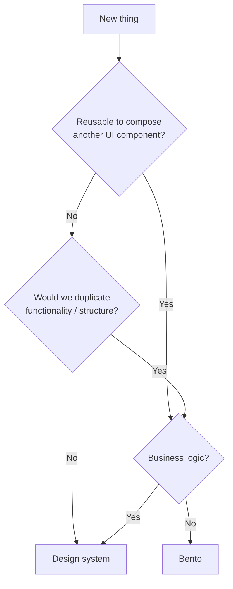

import { Meta } from '@storybook/addon-docs/blocks';

<Meta title="Architecture/Guides/Primitives" />

# Primitives

In Bento, **primitives are reusable pieces of component infrastructure**. They are headless, accessible building blocks you use to create your own component library or design system.

**Bento is not a component library.** Bento is the infrastructure *beneath* a component library. It provides accessibility, behavior, and a composition model so you can implement your own design system without solving those problems repeatedly.

## What Is a Primitive?

A Bento primitive is a minimal, reusable unit of infrastructure. It can be a React component, a hook, a utility function, or any other low-level building block that makes higher-level components easier to implement consistently.

When a primitive *is* a UI component, it packages the parts of UI that should be consistent everywhere: accessibility, interaction behavior, and composability. React Aria is our framework of choice for building accessibility-first primitives.

Primitives intentionally do **not** ship with a "GoDaddy look" or product rules. In Bento, styling and business logic belong to the consuming design system or application.

## Why Primitives?

Bento aims to be the invisible foundation for many different UI systems. Different teams have different needs: styling stacks, tokens, ergonomics, product constraints. If Bento tried to be "the component library", it would quickly become either too opinionated to be reusable, or so configurable that it becomes unmaintainable.

Primitives are the compromise that isn't a compromise: a shared, high-quality accessibility and behavior layer, while consumers build whatever design system they need on top. Primitives intentionally avoid becoming layout utilities, product components, or a forced styling solution. They work equally well with CSS Modules, Tailwind, CSS-in-JS, or anything else.

## Who Are Primitives For?

Primitives are primarily for **component and design system engineers**. Application engineers can use Bento directly, when building custom experiences, but the intended "happy path" is a thin design system layer that wraps primitives and defines the look, tokens, and conventions for a product.

## I want to build a new primitive. Where should it live?

When building something new, ask "who should own it?" This decision tree helps determine whether something belongs in Bento or in a design system built on top:

