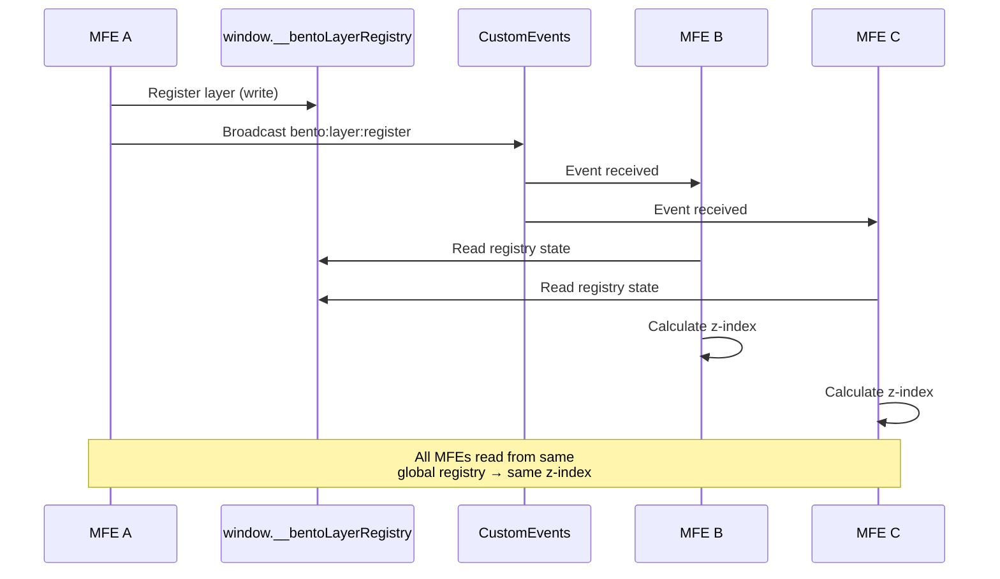

# Use Stack Primitive PDR

## Purpose

The useStack hook provides **peer-to-peer orchestration** for managing competing
UI layers across multiple micro front-end (MFE) applications running on the same
page. It coordinates overlays, toasts, growls, popovers, and other layered UI
patterns when different JavaScript bundles need to display content
simultaneously.

There is **no host application** - coordination happens between MFEs themselves
through the DOM and browser APIs.

The useStack hook addresses several critical scenarios:

- **Cross-bundle coordination**: Multiple independent JavaScript bundles
  displaying UI layers simultaneously
- **Version compatibility**: Different MFEs may use different versions of Bento
  (v1, v2, v3) simultaneously
- **No shared memory**: Bundles cannot access each other's JavaScript memory/state
- **Peer-to-peer communication**: MFEs coordinate directly without a central authority
- **Universal orchestration**: Works for any layered UI pattern (overlays,
  toasts, growls, product tours, etc.)
- **Insert order independence**: Z-index coordination works even when MFEs load
  in different orders

This hook will typically be consumed by:

- Overlay components that need stack management
- Toast/growl notification systems
- Product tour experiences
- Legal/cookie consent modals
- Live chat overlays
- Any UI layer that may compete with others from different MFEs

### Unique Attributes

The useStack hook differs from typical stacking solutions in these key ways:

- **Peer-to-peer**: No host application required - MFEs coordinate between each other
- **Leader election**: One MFE instance becomes leader and coordinates stacking
- **Simple communication**: Uses Custom Events only
- **In-memory state**: All state is ephemeral - resets on page refresh
- **Version-aware**: Handles different versions (v1, v2, v3) running simultaneously

## The Micro Frontend Challenge

When multiple independent JavaScript bundles run on the same page, traditional
React state management fails:

**❌ Doesn't work:**
```tsx
// This only works within a single bundle
const [stack, setStack] = useState([]);
```

**Real-world scenarios that break:**

1. **Product Tour vs Cookie Consent**
   - MFE A (Bento v2) launches product tour (overlay + popovers)
   - MFE B (Bento v1) must show cookie consent modal (legal requirement)
   - Both need to be visible - which should be topmost?
   - **Problem**: No way to coordinate between v1 and v2 bundles

2. **Live Chat vs Host Modal**
   - Live chat MFE wants to show chat overlay
   - Another MFE needs to show critical modal
   - Which experience should users interact with?
   - **Problem**: No host to arbitrate

3. **Competing Growls**
   - MFE A (v2) sends "Order confirmed" toast
   - MFE B (v3) sends "Payment processed" toast
   - Without coordination, they overlap/stack incorrectly
   - **Problem**: Different versions don't know about each other

4. **Version Incompatibility**
   - MFE using Bento v1 cannot coordinate with MFE using Bento v3
   - Each version might use different protocols
   - **Problem**: Need backward compatibility

### Why Traditional Approaches Fail

1. **React Context**: Only works within a single bundle
2. **Shared state**: JavaScript scope memory isn't shared across bundles
3. **Z-index, order, and stacking context race conditions**: Last bundle to
  render wins, not necessarily the most important, especially with the web moving
  towards async bundle loading and dynamic rendering.
4. **No authority system**: No way to determine which MFE's UI should take priority

ecture Overview

### Peer-to-Peer Coordination

The Layer Orchestrator uses a **distributed event system** to coordinate between
all instances:

```
┌─────────────────────────────────────────────────────┐
│            Browser Page (No Host App)               │
│                                                     │
│  ┌──────────────┐ ┌──────────────┐ ┌──────────────┐ │
│  │   MFE 1      │ │   MFE 2      │ │  MFE 3       │ │
│  │  (v2)        │ │  (v1)        │ │  (v3)        │ │
│  │              │ │              │ │              │ │
│  │ ┌──────────┐ │ │ ┌──────────┐ │ │ ┌──────────┐ │ │
│  │ │ Instance │ │ │ │ Instance │ │ │ │ Instance │ │ │
│  │ └──────────┘ │ │ └──────────┘ │ │ └──────────┘ │ │
│  └──────┬───────┘ └──────┬───────┘ └───────┬──────┘ │
│         │                │                 │        │
│         └────────────────┼─────────────────┘        │
│                          │                          │
│      ┌───────────────────▼─────────────────┐        │
│      │   CustomEvents (Bidirectional)      │        │
│      │   - bento:layer:register            │        │
│      │   - bento:layer:unregister          │        │
│      └─────────────────────────────────────┘        │
│                          │                          │
│      ┌───────────────────▼─────────────────┐        │
│      │   window.__bentoLayerRegistry       │        │
│      │   (Shared Global Map)               │        │
│      └─────────────────────────────────────┘        │
└─────────────────────────────────────────────────────┘
```

Key Difference from Leader Election Pattern:
- **No leader election**: All instances are equal
- **Shared global state**: All instances read/write to `window.__bentoLayerRegistry`
- **Event sync**: All broadcast, all listen, all update
- **Independent calculation**: Each calculates z-index from synced state

Problems with leader election (consensus.js pattern):

1. **Single point of failure**: If leader unmounts, coordination stops
2. **State loss**: Leader's state not shared, lost on leader change
3. **Complexity**: Leader election adds complexity and race conditions
4. **Re-election delays**: Time between leader unmount and new leader causes coordination gaps

Benefits of distributed approach:
1. **No single point of failure**: All instances function independently
2. **Immediate sync**: State changes broadcast to all, all update immediately
3. **Simpler**: Each instance maintains state, syncs via events
4. **Resilient**: If one instance fails, others continue coordinating

## Performance Considerations

- **Event-driven**: No polling, uses native DOM events
- **In-memory only**: No storage persistence - state resets on page refresh (as it should)
- **Lazy leadership**: Only leader does calculations
- **Minimal overhead**: Simple Map-based storage in memory
- **Automatic cleanup**: Unmounting removes state naturally

## React Aria or External Hook Integration

The Layer Orchestrator works **alongside** React Aria's overlay system:

- **React Aria**: Handles accessibility, focus management within a single MFE
- **Layer Orchestrator**: Coordinates across MFEs for z-index and state
- **Distributed Events**: Provides peer-to-peer coordination without host

They complement each other:
1. Layer Orchestrator determines z-index across all MFEs (via distributed events)
2. React Aria handles focus/accessibility within that MFE's overlay
3. Layer Orchestrator manages ARIA attributes coordination (only topmost gets aria-modal)
4. React Aria manages ARIA attributes within the controlled overlay

## Architecture & Features

### No Host Setup Required

**No host application setup is required.** Each MFE:

1. Includes Bento layer-orchestrator in its bundle
2. Creates registry on mount (singleton per MFE)
3. Broadcasts registrations/unregistrations via CustomEvents
4. Listens to all broadcasts and updates local registry
5. Calculates z-index independently from synced registry

### State Synchronization

> Note: The `__bentoLayerRegistry` is used as example variable name for the
> shared global registry. Expect this to be finalized in the actual
> implementation.

**Two mechanisms ensure state sync:**

1. **Shared Global Registry (`window.__bentoLayerRegistry`)**: All MFEs on the
  same page share the same JavaScript `window` object, so they can all read/write
  to a shared global Map. This provides immediate visibility - when MFE A writes
  to the registry, MFE B can read it directly.

2. **CustomEvents (Coordination)**: Events notify all instances when the
  registry changes, triggering z-index recalculation. Events are lightweight
  notifications - the actual state is in the shared global.

**Sync flow:**



1. MFE A registers layer → writes to `window.__bentoLayerRegistry` → broadcasts event
2. MFE B receives event → reads from `window.__bentoLayerRegistry` → calculates z-index
3. MFE C receives event → reads from `window.__bentoLayerRegistry` → calculates z-index
4. All MFEs read from same global registry → all calculate same z-index

### Race Condition Handling

**Problem**: Two MFEs register simultaneously

**Solution**: Timestamp-based ordering
- Each registration includes `timestamp: Date.now()`
- When priority/type are equal, newer (higher timestamp) wins
- Timestamps ensure deterministic ordering across all instances

### New Instance Joining

When a new MFE mounts:
1. Initializes `window.__bentoLayerRegistry` if it doesn't exist (or uses existing one)
2. Reads current state directly from the shared global registry
3. Starts listening to events for future changes
4. Immediately has full registry state and can coordinate

**No sync needed**: Since the registry is in shared global memory, new instances automatically see all existing layers as soon as they access `window.__bentoLayerRegistry`.

## API Design

```tsx
function ProductTour({ steps, currentStep }) {
  const isOpen = currentStep < steps.length;
  const { zIndex, isTopmost } = useStack({
    id: 'product-tour',
    type: 'tour',                         //
    priority: 'low',
    isOpen,
  });

  // If we lose topmost status, pause the tour
  useEffect(() => {
    if (!isTopmost && isOpen) showPausedMessage('Cookie consent required. Tour will resume.');
  }, [isTopmost, isOpen]);

  if (!isOpen) return null;

  return (
    <>
      <Overlay isOpen={isTopmost}>
        <Container as="div" slot="backdrop" style={{ zIndex: zIndex - 1 }} />
        <Popover style={{ zIndex }}>
          <Text as="p">Step {currentStep + 1} of {steps.length}</Text>
        </Popover>
      </Overlay>
    </>
  );
}
```

### Layer Types

All layer types are orchestrated, not just overlays:

| Type    | Base Z | Use Cases                  | Stacking Behavior          |
|---------|--------|----------------------------|----------------------------|
| Overlay | 600    | Modals, dialogs            | Block lower priorities     |
| Drawer  | 500    | Side panels, sheets        | Block lower priorities     |
| Chat    | 400    | Live chat widgets          | Non-blocking, persistent   |
| Tour    | 300    | Product tours, onboarding  | Non-blocking, dismissable  |
| Toast   | 200    | Notifications, growls      | Stack vertically, no overlap|
| Popover | 100    | Tooltips, dropdowns        | Non-blocking, contextual   |

### Priority Levels

| Priority  | Level | Use Cases                           | Examples                    |
|-----------|-------|-------------------------------------|----------------------------|
| Critical  | 4     | Legal requirements, critical errors | Cookie consent, GDPR, errors|
| High      | 3     | Important user flows                | Checkout, payment, forms   |
| Normal    | 2     | Standard interactions               | Modals, drawers, settings  |
| Low       | 1     | Non-blocking feedback               | Tours, tips, marketing     |


## Registry

```typescript
registry.configure({
  layers: {
    'overlay': 600,
    ...
  },
  policies: {
    'legal-compliance': 'critical',    // Legal always wins
    'security-mfe': 'critical',        // Security alerts
    'checkout': 'high',                // Checkout flows
    'product-catalog': 'normal',
    'marketing': 'low'                 // Marketing content
  }
});
```

## Accessibility Highlights

The Layer Orchestrator ensures accessibility across MFEs:

- **ARIA modal coordination**: Only topmost modal gets `aria-modal="true"` (each instance calculates independently)
- **Focus management**: Focus stays within the topmost MFE's overlay
- **Screen reader behavior**: Only topmost layer is announced
- **Keyboard navigation**: Escape key dismisses topmost layer first

### Cross-MFE Focus

When layer ordering changes:
1. Previous topmost layer releases focus (returns to trigger)
2. New topmost layer receives focus
3. Screen reader announces new layer
4. Keyboard events handled by new topmost layer
